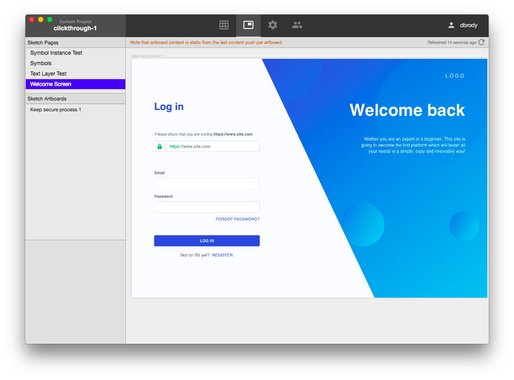
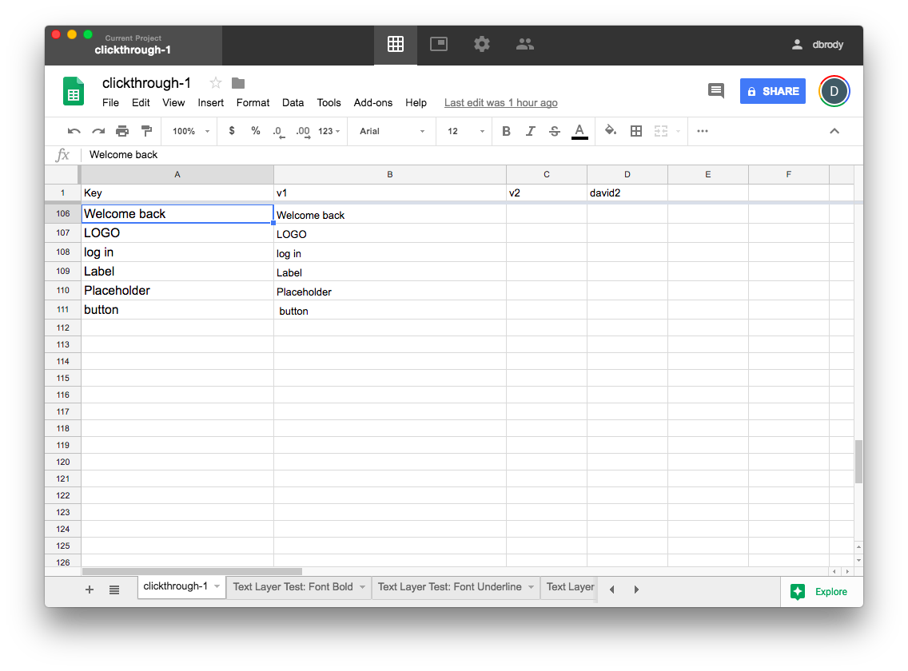

# ContentSync Desktop
Abstract, version, and translate your design content! 

ContentSync Desktop is a companion app to the [ContentSync Sketch Plugin](https://github.com/contentsync/SketchContentSync).

## Features
+ Easily switch between "Artboard" view of your artboards and "Grid" view of your Google Spreadsheet.

### Artboard View

+ Artboard view shows design pages and artboards.
+ Clicking on a Text layer links to Google Spreadsheet cell.

### Grid View

+ Embedded Google Spreadsheet (collaborate like usual)
+ Links directly to the cell of a Text Layer

## Change Log

### June 2018

+ Initial Release!
+ Released alongside Sketch ContentSync 4.2
+ Supports Grid / Artboard views and Linking to Google Spreadsheet from design
+ View/change project settings
+ View/change collaborators
